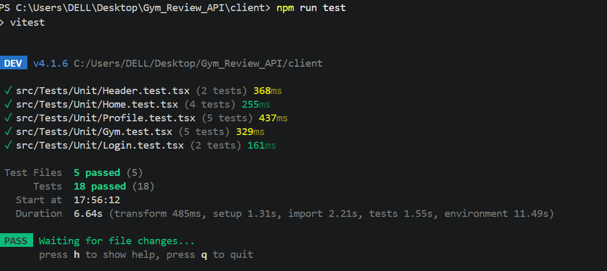
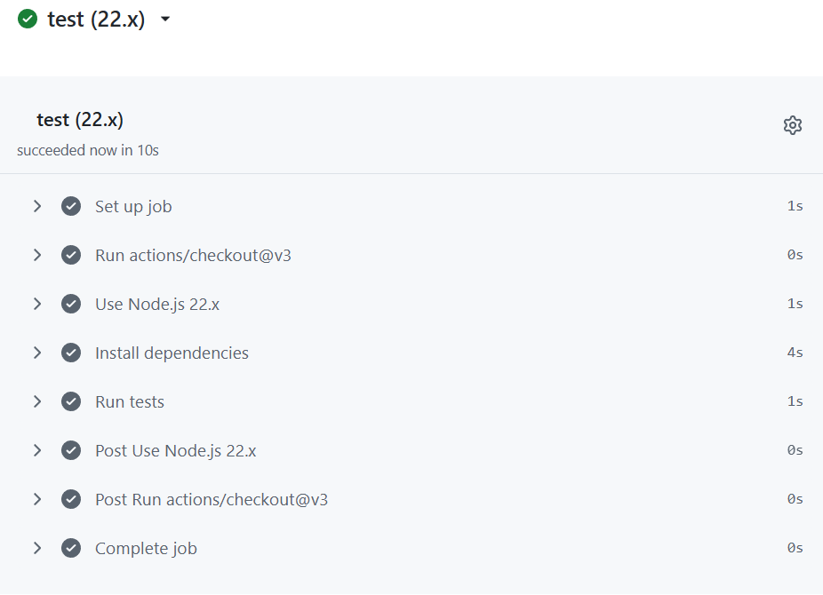

# Gym_Review_API
Gym review API with authorization and testing

This repository contains a backend API and a React client for reviewing gyms. The project uses Auth0 for authentication and Vitest for testing.

**Shared env reference:** See [/.env.example](.env.example) for the variables used by both client and backend.

## Setup

- **How to clone the repository**

	```bash
	git clone https://github.com/<your-username>/Gym_Review_API.git
	cd Gym_Review_API
	```

- **How to install dependencies**

	Backend:
	```bash
	cd backend
	npm install
	```

	Client:
	```bash
	cd client
	npm install
	```

- **How to configure environment variables**

	Copy the example file and fill in required secrets:

	```bash
	cp .env.example .env
	# Edit .env and backend/.env (or set environment variables in your environment)
	```

	- The shared example is available at [/.env.example](.env.example). Fill in `AUTH0_DOMAIN`, `AUTH0_CLIENT_ID`, `AUTH0_CLIENT_SECRET`, and `AUTH0_SECRET` for the backend and the callback URLs for the client.

## Run Locally

- **Start the backend**

	```bash
	cd backend
	npm run dev
	```

- **Start the client**

	```bash
	cd client
	npm run dev
	```

	The client expects the backend at `VITE_BACKEND_URL` (default `http://localhost:3000`).

## Testing

- **How to run the tests locally**

	Backend tests:
	```bash
	cd backend
	npm test
	```

	Client tests:
	```bash
	cd client
	npm test
	```

- **Screenshots**

	- Passing tests locally:

		


		

## Authentication

- **Provider chosen:** Auth0

- **Why Auth0?**

	- The backend is already wired to `express-openid-connect` and Auth0 environment variables (`AUTH0_*`) are used in the project. Auth0 provides a managed, standards-compliant OAuth2 / OpenID Connect provider which simplifies secure authentication flows and session handling.

- **How authentication is implemented**

	- The backend uses `express-openid-connect` (see [backend/auth/auth.ts](backend/auth/auth.ts#L1-L999)) which performs the OpenID Connect flow and manages user sessions server-side using an encrypted session cookie. Routes that require authentication use a `requireAuth` middleware that checks `req.oidc.isAuthenticated()`.

	- The client uses the callback URL from the Auth0 configuration (`VITE_AUTH0_CALLBACK_URL`) to complete the login flow and then the server-side session cookie is used to authenticate API requests.

## Security Decisions (Checklist)

Below is a list of common security checklist items and an explanation of what the project does and why.

- **Tokens & storage**: Tokens are not stored in `localStorage` or other JS-accessible storage. The project relies on the session cookie provided by `express-openid-connect` (HttpOnly, signed by `AUTH0_SECRET`) so tokens are not exposed to client-side scripts. Why: storing tokens in `localStorage` risks theft via XSS; HttpOnly cookies reduce that attack surface.

- **CORS**: The backend sets CORS `origin` to `CLIENT_ORIGIN` (defaults to `http://localhost:5173`) and `credentials: true`. Why: restricting CORS to the known client origin prevents other origins from making authenticated cross-origin requests using the session cookie.


 
 
# Reflection:
**Implementation choices**: We chose Auth0 with express-openid-connect over Firebase because the session-based approach kept authentication logic server-side, which aligned with our security goals — no tokens exposed to client-side JavaScript. Using requiresAuth() middleware also made it straightforward to protect routes consistently without repeating auth logic in each handler.

For the database we used an in-memory array, which let us focus on testing and authentication rather than database setup and migrations. It also made integration tests simpler since there was no external dependency to seed or tear down.

**What was challenging**: The hardest part was protecting routes and then testing them correctly, especially in integration tests. We needed to verify that POST /gyms and POST /gyms/:id/reviews return 401 for unauthenticated requests — but without spinning up a real Auth0 session. We solved this by testing the raw HTTP responses against our app instance directly using node:http, which let us confirm the 401 behavior without mocking the auth middleware away entirely.
 

## Where to look in this repo

- Backend entry: [backend/index.ts](backend/index.ts#L1-L200)
- Backend app factory: [backend/src/app.ts](backend/src/app.ts#L1-L200)
- Auth config: [backend/auth/auth.ts](backend/auth/auth.ts#L1-L200)
- Shared env example: [/.env.example](.env.example)

---

